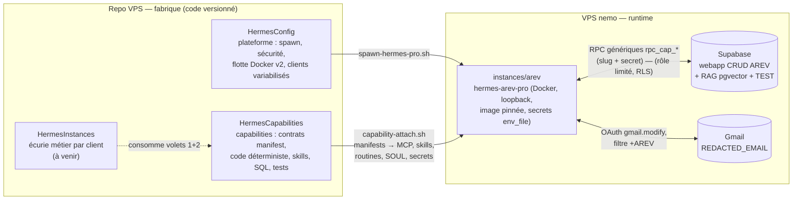

# 🧩 HermesCapabilities — Compétences modulaires des agents Hermes

Sous-projet **volet 2/3** de la fabrique Hermes. Le schéma global de
l'architecture est ci-dessous ; les décisions sont tracées dans
[`DECISIONS.md`](DECISIONS.md) et le design du pipeline email dans
[`PIPELINE_EMAIL_AREV.md`](PIPELINE_EMAIL_AREV.md).

## 🗺️ Architecture globale

### Niveau fabrique — les 3 volets



### Niveau runtime — pipeline email AREV (M2)

```mermaid
flowchart TB
    CRON["⏰ cron */10 · 8h-19h<br/>(silencieux 20h-08h, ≤5 threads)"] --> POLL
    subgraph CODE["Modules CODE déterministes (stdlib Python, testés par fixtures)"]
        POLL["gmail_poll.py<br/>OAuth, filtre +AREV,<br/>-label:ia-traite"]
        TP["thread_parser.py<br/>mailChain → mails structurés<br/>+ statut RAG (déjà/nouveau)"]
        OCR["ocr_gemini.py<br/>TOUTES les PJ → texte + confiance"]
        EMB["embed_gemini.py<br/>text-embedding-004 · 768d"]
        LBL["gmail_label.py<br/>pose label ia-traite"]
    end
    subgraph SKILLS["Skills LLM (Hermes)"]
        CLS["email-classify<br/>catégorie + résumé"]
        ROUTER["expert-router<br/>'ça me concerne ?' → experts"]
        FACT["expert-facturation<br/>extraction JSON strict"]
    end
    subgraph DB[("Supabase — même projet que la webapp CRUD")]
        RPC["RPC génériques rpc_cap_*<br/>(slug + secret) — doc_status · doc_upsert · doc_search<br/>email_upsert · facture_find · facture_upsert<br/>pipeline_log"]
        TBL["cap_arev : documents (pgvector 768)<br/>emails · factures · pipeline_runs"]
    end
    POLL -->|"threads"| TP
    TP -->|"mails nouveaux"| CLS
    CLS --> OCR --> EMB
    EMB -->|"vectors + metadata tags"| RPC
    TP -->|"status"| RPC
    RPC --> UP["RAG indexé"] --> ROUTER
    ROUTER -->|"facturation"| FACT
    FACT -->|"numero+fournisseur"| RPC
    ROUTER -->|"aucun expert"| LBL
    FACT --> LBL --> LOG["pipeline_runs"]
```

> **Deux natures de modules** : les `code/` sont **déterministes** (stdlib
> Python, fixtures unitaires, non-régression verrouillée — cf. D3) ; les
> `skills/` sont pilotés **LLM** (classification, routage, extraction). Les
> accès Supabase passent **exclusivement** par RPC `security definer` avec
> client hardcodé — jamais de service key (cf. DECISIONS D7/D8).

## 🎯 Principe

Une **capability** = une compétence métier granulaire (ex : « lire une boîte
Gmail », « OCR des pièces jointes », « indexer dans le RAG Supabase ») décrite
par un **contrat déclaratif** (`manifest.yaml`). Le client n'active que les
capabilities dont il a besoin : `capability-attach.sh arev email-gmail
rag-supabase …` configure l'instance (MCP, skills, code, routines, secrets,
SOUL.md) — **la flotte part avec ses compétences à l'instanciation ou à
l'update**.

## 🔁 Cycle de vie d'une capability

```
1. ÉTUDE      → decision.md : disponibilité NATIF > MIX > SIDECAR (re-vérifiée à chaque montée de version Hermes)
2. CONTRAT    → manifest.yaml : secrets, env variabilisé, MCP, skills, routines, soul_addendum
3. IMPLÉMENT  → skill.md, mcp.json, routine.yaml, code/ (selon le type retenu)
4. TESTER     → tests/test.sh via scripts/capability-test.sh (local d'abord, VPS ensuite)
5. ATTACHER   → scripts/capability-attach.sh <slug> <capability> (--dry-run d'abord ; refuse si tests KO)
6. INTÉGRER   → HermesConfig v3 consommera les manifests à l'instanciation (integration-hermesconfig.md)
```

## 📂 Structure

```
HermesCapabilities/
├── README.md                      ← Ce fichier (schémas globaux)
├── DECISIONS.md                   ← Registre ADR des décisions (grill 30-31/08)
├── PIPELINE_EMAIL_AREV.md         ← Design détaillé du pipeline email + facturation
├── ARCHITECTURE.md                ← Contrat de capability + matrice natif/mix/sidecar
├── integration-hermesconfig.md    ← Contrat d'interface avec HermesConfig (spawn v3)
├── sql/                           ← Source de vérité SQL (schéma, RPC, RLS) par client
│   └── arev/                      ← 001_schema · 002_rpc · 003_rls
├── capabilities/
│   ├── TEMPLATE/                  ← Squelette d'une nouvelle capability (à copier)
│   ├── rag-supabase/              ← C5 (natif) — RAG pgvector via MCP supabase
│   └── (M2) email-gmail · email-processing · doc-ocr · rag-embeddings ·
│            analysis-facturation · db-crud-sync
├── pipelines/
│   └── TEMPLATE/pipeline.yaml     ← Composition de capabilities (chaîne métier)
└── scripts/
    ├── capability-test.sh         ← Runner des tests unitaires (12 PASS / 0 FAIL)
    └── capability-attach.sh       ← Attache des capabilities à un client (VPS, --dry-run)
```

## 🚀 Quickstart

```bash
# Vérifier le contrat de toutes les capabilities (local, read-only)
./scripts/capability-test.sh all

# Nouvelle capability : copier le TEMPLATE, remplir manifest + decision
cp -r capabilities/TEMPLATE capabilities/ma-capability
$EDITOR capabilities/ma-capability/manifest.yaml capabilities/ma-capability/decision.md
./scripts/capability-test.sh ma-capability

# Sur le VPS — attacher à un client (jamais sans --dry-run la première fois)
sudo ./scripts/capability-attach.sh arev rag-supabase --dry-run
sudo ./scripts/capability-attach.sh arev rag-supabase
```

## 🔗 Références

- Décisions (ADR) : [`DECISIONS.md`](DECISIONS.md) · Architecture contrats : [`ARCHITECTURE.md`](ARCHITECTURE.md)
- Pipeline email + facturation AREV : [`PIPELINE_EMAIL_AREV.md`](PIPELINE_EMAIL_AREV.md)
- Interface avec HermesConfig : [`integration-hermesconfig.md`](integration-hermesconfig.md)
- Veille Hermes : [`../HermesConfig/VEILLE_HERMES_2026-08.md`](../HermesConfig/VEILLE_HERMES_2026-08.md)
- Vault : `/home/syncthing/obsidian-vault/VPS/HermesCapabilities/`
