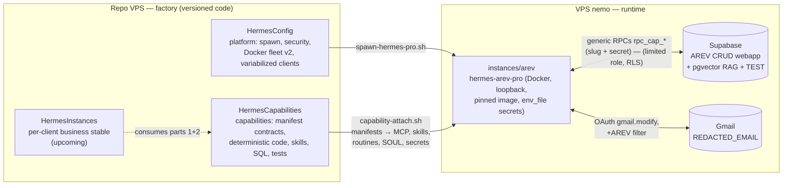

# 🧩 HermesCapabilities — Modular skills of the Hermes agents

Sub-project **part 2/3** of the Hermes factory. The overall architecture
diagram is below; decisions are tracked in
[`DECISIONS.md`](DECISIONS.md) and the email pipeline design in
[`PIPELINE_EMAIL_AREV.md`](PIPELINE_EMAIL_AREV.md).

## 🗺️ Overall architecture

### Factory level — the 3 parts



### Runtime level — AREV email pipeline (M2)

```mermaid
flowchart TB
    CRON["⏰ cron */10 · 8am-7pm<br/>(silent 8pm-8am, ≤5 threads)"] --> POLL
    subgraph CODE["Deterministic CODE modules (Python stdlib, tested by fixtures)"]
        POLL["gmail_poll.py<br/>OAuth, +AREV filter,<br/>-label:ia-traite"]
        TP["thread_parser.py<br/>mailChain → structured emails<br/>+ RAG status (existing/new)"]
        OCR["ocr_gemini.py<br/>ALL attachments → text + confidence"]
        EMB["embed_gemini.py<br/>gemini-embedding-001 · 768d"]
        LBL["gmail_label.py<br/>applies label ia-traite"]
    end
    subgraph SKILLS["LLM Skills (Hermes)"]
        CLS["email-classify<br/>category + summary"]
        ROUTER["expert-router<br/>'does it concern me?' → experts"]
        FACT["expert-facturation<br/>strict JSON extraction"]
    end
    subgraph DB[("Supabase — same project as the CRUD webapp")]
        RPC["Generic RPCs rpc_cap_*<br/>(slug + secret) — doc_status · doc_upsert · doc_search<br/>email_upsert · facture_find · facture_upsert<br/>pipeline_log"]
        TBL["cap_arev: documents (pgvector 768)<br/>emails · factures · pipeline_runs"]
    end
    POLL -->|"threads"| TP
    TP -->|"new emails"| CLS
    CLS --> OCR --> EMB
    EMB -->|"vectors + metadata tags"| RPC
    TP -->|"status"| RPC
    RPC --> UP["Indexed RAG"] --> ROUTER
    ROUTER -->|"invoicing"| FACT
    FACT -->|"numero+fournisseur"| RPC
    ROUTER -->|"no expert"| LBL
    FACT --> LBL --> LOG["pipeline_runs"]
```

> **Two kinds of modules**: `code/` modules are **deterministic** (stdlib
> Python, unit fixtures, locked non-regression — see D3); `skills/` are
> **LLM-driven** (classification, routing, extraction). Supabase access goes
> **exclusively** through `security definer` RPCs with
> hardcoded client — never a service key (see DECISIONS D7/D8).

## 🎯 Principle

A **capability** = a granular business skill (e.g. "read a Gmail
inbox", "OCR attachments", "index into the Supabase RAG") described
by a **declarative contract** (`manifest.yaml`). The client only activates the
capabilities it needs: `capability-attach.sh arev email-gmail
rag-supabase …` configures the instance (MCP, skills, code, routines, secrets,
SOUL.md) — **the fleet ships with its skills at instantiation or
update time**.

## 🔁 Capability life cycle

```
1. STUDY      → decision.md: NATIVE > MIX > SIDECAR availability (re-checked at every Hermes version bump)
2. CONTRACT   → manifest.yaml: secrets, variabilized env, MCP, skills, routines, soul_addendum
3. IMPLEMENT  → skill.md, mcp.json, routine.yaml, code/ (depending on the chosen type)
4. TEST       → tests/test.sh via scripts/capability-test.sh (local first, then VPS)
5. ATTACH     → scripts/capability-attach.sh <slug> <capability> (--dry-run first; refuses if tests fail)
6. INTEGRATE  → HermesConfig v3 will consume the manifests at instantiation (integration-hermesconfig.md)
```

## 📂 Structure

```
HermesCapabilities/
├── README.md                      ← This file (global diagrams)
├── DECISIONS.md                   ← ADR registry of decisions (grid 30-31/08)
├── PIPELINE_EMAIL_AREV.md         ← Detailed design of the email + invoicing pipeline
├── ARCHITECTURE.md                ← Capability contract + native/mix/sidecar matrix
├── integration-hermesconfig.md    ← Interface contract with HermesConfig (spawn v3)
├── sql/                           ← SQL source of truth (schema, RPC, RLS) per client
│   └── arev/                      ← 001_schema · 002_rpc · 003_rls
├── capabilities/
│   ├── TEMPLATE/                  ← Skeleton of a new capability (to copy)
│   ├── rag-supabase/              ← C5 (native) — pgvector RAG via supabase MCP
│   └── (M2) email-gmail · email-processing · doc-ocr · rag-embeddings ·
│            analysis-facturation · db-crud-sync
├── pipelines/
│   └── TEMPLATE/pipeline.yaml     ← Composition of capabilities (business chain)
└── scripts/
    ├── capability-test.sh         ← Unit test runner (12 PASS / 0 FAIL)
    └── capability-attach.sh       ← Attaches capabilities to a client (VPS, --dry-run)
```

## 🚀 Quickstart

```bash
# Verify the contract of all capabilities (local, read-only)
./scripts/capability-test.sh all

# New capability: copy the TEMPLATE, fill in manifest + decision
cp -r capabilities/TEMPLATE capabilities/ma-capability
$EDITOR capabilities/ma-capability/manifest.yaml capabilities/ma-capability/decision.md
./scripts/capability-test.sh ma-capability

# On the VPS — attach to a client (never without --dry-run the first time)
sudo ./scripts/capability-attach.sh arev rag-supabase --dry-run
sudo ./scripts/capability-attach.sh arev rag-supabase
```

## 🔗 References

- Decisions (ADR): [`DECISIONS.md`](DECISIONS.md) · Architecture contracts: [`ARCHITECTURE.md`](ARCHITECTURE.md)
- AREV email + invoicing pipeline: [`PIPELINE_EMAIL_AREV.md`](PIPELINE_EMAIL_AREV.md)
- Interface with HermesConfig: [`integration-hermesconfig.md`](integration-hermesconfig.md)
- Hermes tech watch: [`../HermesConfig/VEILLE_HERMES_2026-08.md`](../HermesConfig/VEILLE_HERMES_2026-08.md)
- Vault: `/home/syncthing/obsidian-vault/VPS/HermesCapabilities/`
