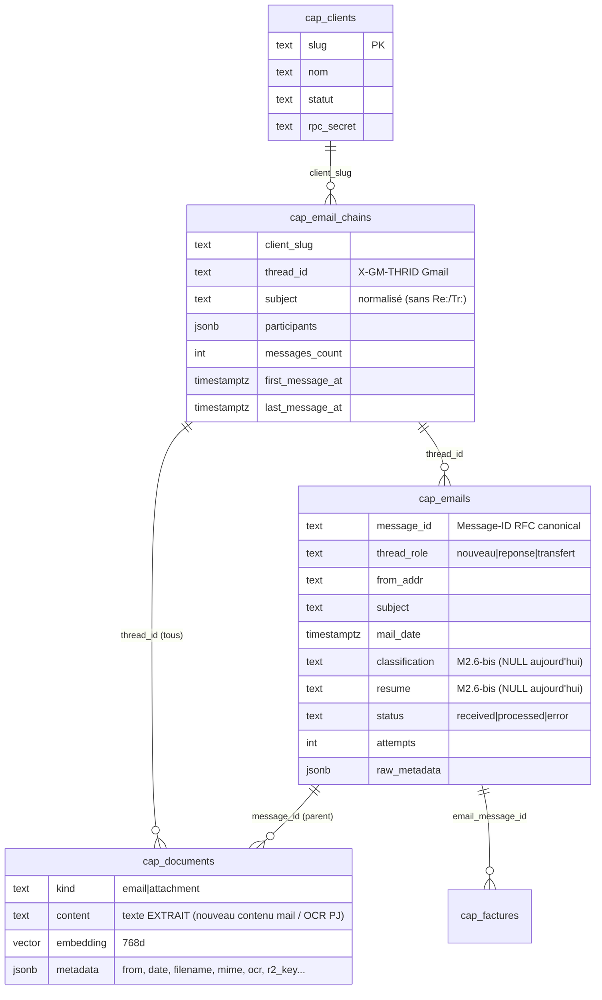

# 🔌 WEBAPP_DATA_MAPPING.md — Contrat de données Supabase pour la webApp (Alinea)

> **Audience** : session opencode webApp. Date : 2026-09-06 (M2.7).
> La pipeline écrit ; la webApp lit. Toutes les données sont dans le projet
> Supabase unique (multi-tenant, le slug discrimine — DECISIONS D7-v2).
> Schéma source de vérité : `HermesCapabilities/sql/generic/`.

---

## 1. Le modèle de données en un regard



> ⚠️ **`cap_emails` ≠ affichage des mails** : c'est le registre de traitement
> (statut, erreurs, retries). Le **contenu** des mails vit dans
> `cap_documents` (kind=`email`, join sur `message_id`). La mailChain
> "gmail-like" = `cap_email_chains` (feuille) + `cap_emails` (rangées
> ordonnées par `mail_date`) + contenus via `cap_documents`.

---

## 2. Requêtes cookbook (webapp, service key ou RPC slug+secret)

### 2.1 Liste des mailChains d'un client (inbox vue Gmail)

```sql
select e.*, (select count(*) from public.cap_documents d
             where d.thread_id = e.thread_id and d.kind='attachment'
               and d.client_slug = e.client_slug) as pj_count
from public.cap_email_chains e
where e.client_slug = :slug and e.statut_client = 'active'
order by e.last_message_at desc;
```

### 2.2 Détail d'une mailChain (vue "gmail-like")

- Chaîne : 1 ligne `cap_email_chains` par `thread_id`
- Mails, ordre chronologique :
```sql
select message_id, thread_role, from_addr, subject, mail_date, status
from public.cap_emails
where client_slug = :slug and thread_id = :thread_id
order by mail_date;
```
- Contenu de chaque mail (corps) :
```sql
select title, content, metadata->>'r2_key' as r2_key
from public.cap_documents
where client_slug = :slug and thread_id = :thread_id and kind = 'email';
```
- PJ du thread (OCR en texte + brut R2) :
```sql
select id, title, content, metadata->>'r2_key' as r2_key,
       metadata->>'filename' as filename
from public.cap_documents
where client_slug = :slug and thread_id = :thread_id and kind = 'attachment';
```
> Join email→PJ : `cap_documents.parent_message_id` = le mail porteur.
> Lie facture→PJ : `cap_factures.document_id` → `cap_documents.id`.

### 2.3 Dernier mail reçu (par client)

```sql
select * from public.cap_emails
where client_slug = :slug
order by mail_date desc limit 1;
-- chain associée : cap_email_chains par thread_id
```

> ⚔️ **Ordre des rangs** : pas de colonne `position` — trier par
> `mail_date` (ré-ordonnancement déterministe suffit pour l'affichage gmail).

### 2.4 Chat spécialisé dans la mailChain (sémantique, thread-scopé)

**Contrat** : la pipeline a déjà indexé le contenu de CHAQUE mail (contenu
nouveau) et de CHAQUE PJ (OCR) avec embedding **`gemini-embedding-001`
768d** (`cap_documents.embedding`, colonne `thread_id`).

Le **backend webapp** fait lui-même :
1. `embed(question)` via Gemini API — **modelle identique, 768d**
   (`gemini-embedding-001`, contrat figé D5)
2. **Recherche vectorielle pgvector** :
   ```sql
   select id, kind, title, content, metadata,
          1 - (embedding <=> :query_vector) as similarity
   from public.cap_documents
   where client_slug = :slug and thread_id = :thread_id
     and embedding is not null
   order by embedding <=> :query_vector
   limit :n;
   ```
   (via client Postgres direct ou une fonction SQL exposée en rpc —
   `sql/generic/007_doc_match.sql` fournit la fonction générique
   `rpc_cap_doc_match(slug, secret, embedding, count, thread_id)`)
3. Alimenter le **context du system prompt** du LLM du chat avec les
   passages top-N (ne pas dépasser la window du modèle)

> pgvector (`<=>`) ne passe pas par les filtres REST PostgREST standard —
> la comparaison s'exécute **dans Postgres** (fonction SQL ou client PG).
> La webapp ne passe **jamais** par le runtime pipeline pour le chat.

### 2.5 Voir l'email brut / la PJ d'origine (W12)

- `cap_documents.metadata->>'r2_key'` = clé R2 exacte de l'objet archivé
  (mail → `thread.json` ; PJ → son fichier) — même convention :
  `<GED_EMAIL_PREFIX>/<slug>/emails/<thread_id>/<fichier>`
  (GED_EMAIL_PREFIX=`emails` par défaut)
- URL signée R2 : générer côté backend webapp avec les credentials R2
  (durée courte, GET). Si `r2_key` absent → le GED a échoué pour ce doc
  (non-bloquant, cf. D14/IED) — l'affichage brut n'est pas disponible.

### 2.4bis Factures (CRUD webapp)

```sql
select * from public.cap_factures
where client_slug = :slug
order by created_at desc;
```
- `statut` : `extracted` (auto) → humain fait"`valide`/`rejete` → `paye`/`archive`
- `extraction` (jsonb) = payload audit : facture canonique + `sums`
  (vérification arithmétique) + `judge` (scores OCR/agreement)
- ⚠️ ne jamais écrire `statut: extracted` côté webapp (c'est le pipeline) ;
  les transitions humaines sont les seules autorisées (D6/non-rétrogradation
  protégée parRPC).

---

## 3. Conventions sécurité (suite de D8-v3)

| Type d'accès webApp | Clé à utiliser |
|---|---|
| Lecture tables (SELECT) | **Service key** (backend webapp, jamais au client) |
| Chat sémantique | Service key **ou** RPC `rpc_cap_doc_match` (slug + `CLIENT_RPC_SECRET` — pattern D8-v3 identique aux agents) |
| Écritures factures (`statut` humain) | Service key (bypass RLS) — mais seulement les colonnes métier, jamais `statut: extracted` |
| Embedding des questions | `VPS_GEMINI_API_KEY` (backend webapp) — même modèle 768d |

## 4. Gaps connus et horaires (État au 2026-09-06)

| Gap | Impact webapp | Résolution prévue |
|---|---|---|
| `cap_emails.resume`/`classification` = **NULL** | Affichage des résumés vides | M2.6-bis : classify LLM branché terrain pipeline (étape choisie du prompt routine) |
| `parse_degraded` (parsing douteux d'un provider exotique) | Signal à afficher si présent | Flag en `cap_documents.metadata` — plan B SLM en M3 |
| Confiance facture 0,686 dans la 1ʳᵉ factura | "Pourquoi si basse" | **Explain** : 0.98 (Gemini) × 0.7 (mode dégradé 1 extracteur) ; les prochains runs à 2 extracteurs (PJ images) → ~0.83 ; factura PDF spécifique → ×0.85 (D14 révisé à venir) |
| Position de mail dans la chaîne non stockée | Tri parallèle possible | Calculable (mail_date) ou M3 (colonne email_position) |
| Ordre des mails : ordre chronologique | — | OK |

## 5. JSON pour l'écran "vue mailChain" (suggestion de shape pour Alinea)

```json
{
  "chain": {"thread_id": "...", "subject": "Facture situ MARS 26...", 
             "participants": ["..."], "messages_count": 3},
  "mails": [
    {"message_id": "<msgA>", "role": "nouveau", "from": "...", "date": "...",
     "content": [ depuis cap_documents kind=email par message_id ],
     "r2_key": "emails/arev/emails/<thread>/thread.json",
     "attachments": [{"filename": "...", "content": [doc kind=attachment], 
                       "r2_key": "emails/arev/emails/<thread>/att-1-..."}]}
  ],
  "factures": [{...}]   // via cap_factures where email_message_id in mails
}
```

Le format exact des routes est de la responsabilité de la webApp ; ce
document fixe uniquement **la donnée disponible et ses conventions**.
