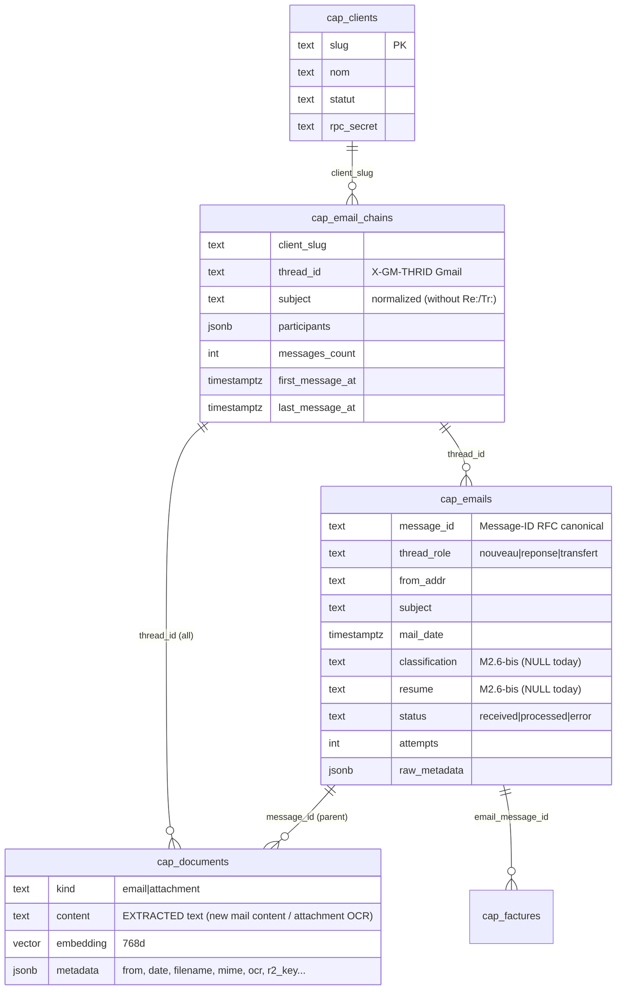

# 🔌 WEBAPP_DATA_MAPPING.md — Supabase data contract for the webApp (Alinea)

> **Audience**: webApp opencode session. Date: 2026-09-06 (M2.7).
> The pipeline writes; the webApp reads. All data is in the single
> Supabase project (multi-tenant, the slug discriminates — DECISIONS D7-v2).
> Source-of-truth schema: `HermesCapabilities/sql/generic/`.

---

## 1. The data model at a glance



> ⚠️ **`cap_emails` ≠ mail display**: it is the processing register
> (status, errors, retries). Mail **content** lives in
> `cap_documents` (kind=`email`, join on `message_id`). The "gmail-like" mailChain
> = `cap_email_chains` (sheet) + `cap_emails` (rows
> ordered by `mail_date`) + contents via `cap_documents`.

---

## 2. Cookbook queries (webapp, service key or RPC slug+secret)

### 2.1 List of a client's mailChains (Gmail-like inbox view)

```sql
select e.*, (select count(*) from public.cap_documents d
             where d.thread_id = e.thread_id and d.kind='attachment'
               and d.client_slug = e.client_slug) as pj_count
from public.cap_email_chains e
where e.client_slug = :slug and e.statut_client = 'active'
order by e.last_message_at desc;
```

### 2.2 Detail of a mailChain ("gmail-like" view)

- Chain: 1 `cap_email_chains` row per `thread_id`
- Emails, chronological order:
```sql
select message_id, thread_role, from_addr, subject, mail_date, status
from public.cap_emails
where client_slug = :slug and thread_id = :thread_id
order by mail_date;
```
- Content of each email (body):
```sql
select title, content, metadata->>'r2_key' as r2_key
from public.cap_documents
where client_slug = :slug and thread_id = :thread_id and kind = 'email';
```
- Thread attachments (OCR text + raw R2):
```sql
select id, title, content, metadata->>'r2_key' as r2_key,
       metadata->>'filename' as filename
from public.cap_documents
where client_slug = :slug and thread_id = :thread_id and kind = 'attachment';
```
> Email→attachment join: `cap_documents.parent_message_id` = the carrying email.
> Invoice→attachment link: `cap_factures.document_id` → `cap_documents.id`.

### 2.3 Last received email (per client)

```sql
select * from public.cap_emails
where client_slug = :slug
order by mail_date desc limit 1;
-- associated chain: cap_email_chains by thread_id
```

> ⚔️ **Row ordering**: no `position` column — sort by
> `mail_date` (deterministic re-ordering is enough for the gmail display).

### 2.4 Chat specialized in the mailChain (semantic, thread-scoped)

**Contract**: the pipeline has already indexed the content of EACH email (new
content) and of EACH attachment (OCR) with an **`gemini-embedding-001`
768d** embedding (`cap_documents.embedding`, `thread_id` column).

The **webapp backend** does itself:
1. `embed(question)` via Gemini API — **identical model, 768d**
   (`gemini-embedding-001`, frozen contract D5)
2. **pgvector vector search**:
   ```sql
   select id, kind, title, content, metadata,
          1 - (embedding <=> :query_vector) as similarity
   from public.cap_documents
   where client_slug = :slug and thread_id = :thread_id
     and embedding is not null
   order by embedding <=> :query_vector
   limit :n;
   ```
   (via a direct Postgres client or an SQL function exposed as an rpc —
   `sql/generic/007_doc_match.sql` provides the generic function
   `rpc_cap_doc_match(slug, secret, embedding, count, thread_id)`)
3. Feed the **system prompt context** of the chat LLM with the
   top-N passages (do not exceed the model's window)

> pgvector (`<=>`) does not go through standard PostgREST REST filters —
> the comparison runs **inside Postgres** (SQL function or PG client).
> The webapp **never** goes through the pipeline runtime for the chat.

### 2.5 View the raw email / original attachment (W12)

- `cap_documents.metadata->>'r2_key'` = exact R2 key of the archived object
  (email → `thread.json`; attachment → its file) — same convention:
  `<GED_EMAIL_PREFIX>/<slug>/emails/<thread_id>/<file>`
  (GED_EMAIL_PREFIX=`emails` by default)
- R2 signed URL: generated on the webapp backend side with the R2
  credentials (short duration, GET). If `r2_key` is absent → the GED failed for this doc
  (non-blocking, cf. D14/IED) — raw display is not available.

### 2.4bis Invoices (webapp CRUD)

```sql
select * from public.cap_factures
where client_slug = :slug
order by created_at desc;
```
- `statut`: `extracted` (auto) → human does"`valide`/`rejete` → `paye`/`archive`
- `extraction` (jsonb) = audit payload: canonical invoice + `sums`
  (arithmetic check) + `judge` (OCR/agreement scores)
- ⚠️ never write `statut: extracted` on the webapp side (that's the pipeline);
  human transitions are the only ones allowed (D6/no-downgrade
  protected byRPC).

---

## 3. Security conventions (continuation of D8-v3)

| webApp access type | Key to use |
|---|---|
| Table reads (SELECT) | **Service key** (webapp backend, never to the client) |
| Semantic chat | Service key **or** RPC `rpc_cap_doc_match` (slug + `CLIENT_RPC_SECRET` — D8-v3 pattern identical to the agents) |
| Invoice writes (human `statut`) | Service key (RLS bypass) — but only business columns, never `statut: extracted` |
| Embedding of questions | `VPS_GEMINI_API_KEY` (webapp backend) — same 768d model |

## 4. Known gaps and schedules (State as of 2026-09-06)

| Gap | webapp impact | Planned resolution |
|---|---|---|
| `cap_emails.resume`/`classification` = **NULL** | Empty summaries displayed | M2.6-bis: LLM classify wired into the pipeline ground (chosen step of the routine prompt) |
| `parse_degraded` (dubious parsing of an exotic provider) | Signal to display if present | Flag in `cap_documents.metadata` — SLM plan B in M3 |
| Invoice confidence 0,686 in the 1st invoice | "Why so low" | **Explain**: 0.98 (Gemini) × 0.7 (degraded mode 1 extractor); next runs with 2 extractors (image attachments) → ~0.83; specific PDF invoice → ×0.85 (D14 revised to come) |
| Mail position in the chain not stored | Possible parallel sorting | Computable (mail_date) or M3 (email_position column) |
| Mail order: chronological order | — | OK |

## 5. JSON for the "mailChain view" screen (shape suggestion for Alinea)

```json
{
  "chain": {"thread_id": "...", "subject": "Facture situ MARS 26...", 
             "participants": ["..."], "messages_count": 3},
  "mails": [
    {"message_id": "<msgA>", "role": "nouveau", "from": "...", "date": "...",
     "content": [ from cap_documents kind=email by message_id ],
     "r2_key": "emails/arev/emails/<thread>/thread.json",
     "attachments": [{"filename": "...", "content": [doc kind=attachment], 
                       "r2_key": "emails/arev/emails/<thread>/att-1-..."}]}
  ],
  "factures": [{...}]   // via cap_factures where email_message_id in mails
}
```

The exact format of the routes is the webApp's responsibility; this
document fixes only **the available data and its conventions**.
