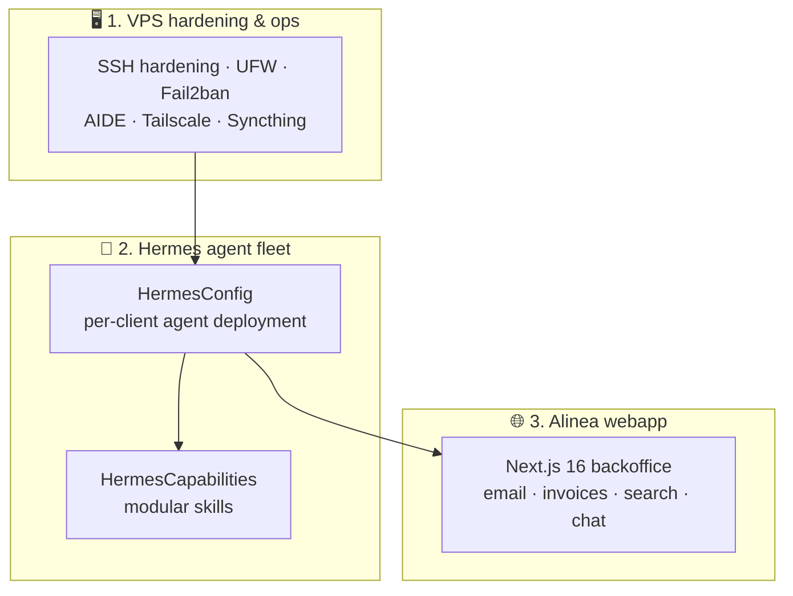

# VPS Platform — Hardened server, agent fleet & client webapp

[](https://www.docker.com/)
[](https://ubuntu.com/)
[](Installation/RAPPORT_AUDIT_2026-08-30.md)
[](https://nextjs.org/)
[](HermesConfig/README.md)

> A self-hosted AI operations platform: a security-hardened VPS running a fleet of Dockerized AI agents (personal + small-business clients), with modular capabilities and a Next.js client backoffice.

This repository documents and drives everything running on a **Contabo VPS**
(Ubuntu 22.04 LTS): infrastructure hardening, a production-grade **AI agent
fleet**, a library of reusable **capabilities** (email, OCR, RAG, GED…), and
**Alinea**, the web backoffice where SMB clients review agent work
(invoice analysis, email triage…). The README of each sub-project is in
English; deeper operational docs are in French.

All deployment identifiers (IP, hostname, SSH port/key…) are **kept out of the
repo** — they live in local environment variables, see
[`LOCAL_SETUP.md`](LOCAL_SETUP.md).

## 🧱 The three pillars



### 🖥️ 1. [`Installation/`](Installation/README.md) — VPS hardening & operations
Sovereign-ops discipline on a single cloud server: SSH hardening (port, ciphers,
keys), UFW & Fail2ban, AIDE integrity monitoring, secrets in `/etc/secrets`,
Syncthing + Obsidian knowledge sync. Includes a
[final hardening plan](Installation/VPS_HARDENING_PLAN_FINAL.md), the
[security audit report](Installation/RAPPORT_AUDIT_2026-08-30.md) and
non-regression **OpenCode skills** that verify in read-only mode that the
validated state never regresses (`vps-check-repo`, `vps-check-securite`,
`vps-check-sync`, `check-hermesconfig` — orchestrated by a single
`vps-check-full` PASS/FAIL run).

### 🤖 2. Hermes — AI agent fleet
- [`HermesConfig/`](HermesConfig/README.md) — professional, fully-templated
  deployment of [Hermes agents](https://nousresearch.com/) for SMB clients:
  one `clients/TEMPLATE/` + 3 variables = a new hardened Docker agent sandbox
  (least-privilege caps, non-root UID, localhost-bound ports, zero secrets in
  YAML/git, explicit `SOUL.md` behavior contract).
  Client deployments are automated by `spawn-hermes-pro.sh` and audited by
  `audit-hermes-pro.sh`.
- [`HermesCapabilities/`](HermesCapabilities/README.md) — the modular skill
  library agents are built on: email processing (Gmail), document OCR,
  RAG/embeddings (Supabase), GED on Cloudflare R2, invoicing analysis — each
  with manifest contract, lifecycle and test script.

> **Scope note:** this platform powers **professional agent deployments for two
> SMB clients** (construction-sector SaaS — see pillar 3) *and* a personal
> agent workspace. Personal-fleet details and session notes live in the local
> `internal/` folder (gitignored) and are intentionally out of this repository.

### 🌐 3. [`Alinea/`](Alinea/README.md) — client webapp (Next.js 16)
The backoffice where SMB end-users see agent results: emails, invoices with
AI-extracted values, RAG search, expert chat. Highlights:
- **SQL as source of truth** — `openapi.yaml` is *generated from the database
  DDL* and types from `supabase gen types`; a CI `pnpm gen:check` fails on any
  drift between SQL ⇄ OpenAPI ⇄ TypeScript
- One Cloud Run service (Next.js App Router + API route handlers in the same
  deployment), shadcn/ui design system in a shared package
- [ADR-style decisions log](Alinea/DECISIONS.md) records every architectural trade-off

## 🚀 Quick access

```bash
# Deploy a hardened client agent (on the VPS)
cd HermesConfig && ./scripts/spawn-hermes-pro.sh <client-slug>

# Webapp backoffice
cd Alinea && pnpm dev && pnpm gen:check

# Full non-regression security check (read-only)
```
Skills are invoked by name through [OpenCode](https://opencode.ai/) (e.g.
*“run vps-check-full”*).

## 📂 Repository layout

```
VPS/
├── Installation/        # Hardening plan, audit, ops docs, scripts
├── HermesConfig/        # Client agent deployment (template-driven)
├── HermesCapabilities/  # Modular agent skills (+ capabilities/, pipelines/)
├── Alinea/              # Next.js client webapp (monorepo, SQL→OpenAPI)
├── LOCAL_SETUP.md       # Where deployment identifiers live (local env)
└── .env.example / .env.local   # Local, gitignored values
```
